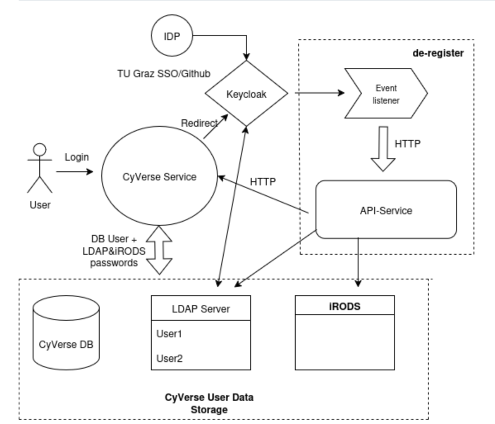
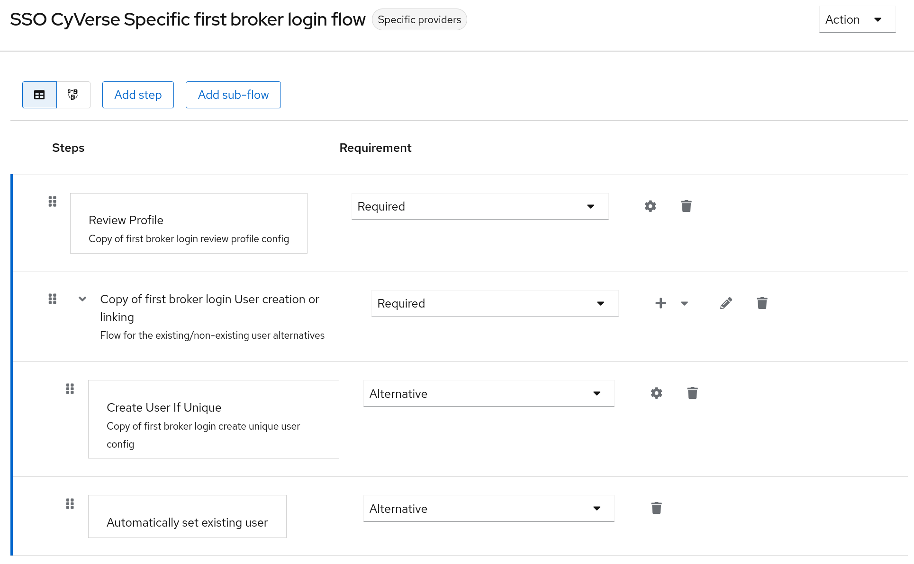
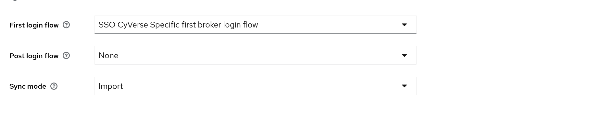

# de-register

Services needed to fully register a new user that logs through keycloak in cyverse

## [event-listener](event-listener/README.md)
Keycloak plugin that captures user data and sends it to a REST API

## [api-service](api-service/README.md)
API that receives users data and registers it in LDAP and iRODS

## [register-test](register-test/README.md)
For now a basic script that sets up all services needed to locally test this service

## Flow

A diagram that illustrates the basic flow of data for a CyVerse service login flow using this service.

**Example usecase**:

**Note:** The steps related to CyVerse User portal are not valid for now.

1. User tries to login in CyVerse User portal
2. Redirect to Keycloak -> Login through SSO
3. Event-listener is triggered -> actions are sent via HTTP to api-service
4. Api-service does the following
    - creates an LDAP account with CyVerse specific attributes
    - creates new iRODS user
    - sends HTTP request to CyVerse User portal to create the CyVerse User in the database
5. Event-listener sets ldap-specific attributes and add the user to the required groups in Keycloak
6. Once the user is in the CyVerse database, the home page should appear
7. The user gets the Welcome email from CyVerse. In the email there is a link used to set a password.
8. CyVerse user portal sets the password chosen by the user to LDAP and iRODS
9. Now user has the account from SSO linked to all the needed user storages in CyVerse

## Keycloak custom first broker login flow (SSO Specific)
Because we want to keep **LDAP Edit Mode: READ_ONLY**, syncing newly created LDAP account with the user coming from SSO proves to be a challenge.
All **new** accounts **won't have an issue** logging in because de-register handles every setup required for CyVerse registration, but existing accounts
that are already federated through LDAP can be a problem with the normal **first broken login flow**. If we want to avoid the extra verification step in this case, that prompts the user to add its LDAP credentials, we must create a new login flow, as the one in the image:

To easily create this, go to your realm -> Authentication -> first broker login -> duplicate, then choose a name for the copy and follow the flow in the image.

Then choose this in your identity provider setup:

With this in place, when the user that already has an LDAP account in Keycloak tries to authenticate with SSO + de-register, Keycloak will just choose the already existing LDAP account without any extra step.

### CyVerse User portal
de-register supports user portal automatic registration but for now the call and endpoint are disabled.
