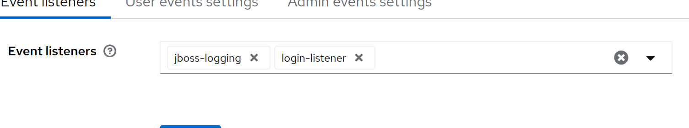

# event-listener
Keycloak Event-Listener custom implementation that acts as a REST API Client and sends requests to an external service for
creation of LDAP, iRODS and User Portal accounts based on information received from the user that authenticates through Keycloak.

## Configure inside Keycloak
Select the target _realm_, go to _Realm settings_ -> _Events_, search and add **login-listener**.



## Docker
When building an image to a docker namespace, use **Dockerfile** (context: .). That is just a busybox container with the JAR copied inside of it.
Then, use the container to extract the jar inside _/opt/keycloak/providers/_ directory **BEFORE** starting the Keycloak service. Only having the
plugin JAR available at that path will make this flow work as expected.

Make sure to set this environment variable for the keycloak container: 
```KC_SPI_EVENTS_LISTENER_LOGIN_LISTENER_API_SERVICE_HOST: <URL_OF_API_SERVICE>```

### Extra config options
Set allowed Keycloak clients to trigger the event-listener. Add one or more clients separated by **,**. If option is not set, then all clients will
trigger the plugin at LOGIN events.
```KC_SPI_EVENTS_LISTENER_LOGIN_LISTENER_CLIENT_ID: <client1>,<client2>```

## Authentication
The API service has authentication implemented. To successfully login with the event-listener in the api-service, make sure to configure these
variables:
```
KC_SPI_EVENTS_LISTENER_LOGIN_LISTENER_API_KEY: <api_key>
KC_SPI_EVENTS_LISTENER_LOGIN_LISTENER_SERVICE_MAIL: test.user@example.com
KC_SPI_EVENTS_LISTENER_LOGIN_LISTENER_SERVICE_PASSWORD: testpass
```
API service should have a user configured for event-listener, then the user credentials should be the same as here.

## Local testing
Testing should be done by using register-test module to start all necessary services.

- clone this repo
- ``mvn clean install``
- check [register-test](../register-test/README.md) for next steps
